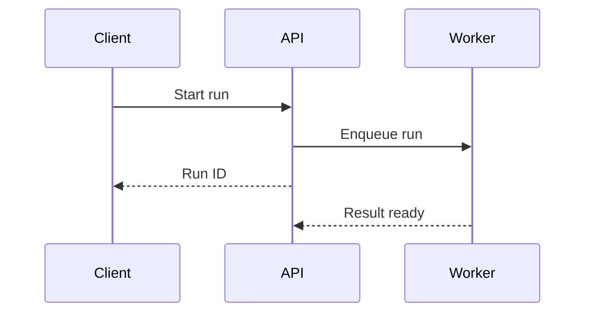

# Visualize

Choose the smallest structural view that makes the requested system or behavior clear. Lead with the answer and use brief prose for context, caveats, or details the visual cannot express.

## Ground the View

- Inspect the relevant code before describing an existing system. Distinguish observed behavior from proposed changes and unresolved assumptions.
- Show the components, boundaries, decisions, and effects needed to answer the question. Omit incidental wrappers and helper calls.
- Keep views readable. For large systems, show the overview and the relevant detail in separate views; continue the requested explanation without requiring a follow-up to zoom in.
- Link real code locations using clickable file paths outside code fences. Mark conceptual pseudocode and proposed structures clearly.

## Choose the Representation

| Question | Representation | Include |
| --- | --- | --- |
| How does a request execute? | Call tree or flowchart | Key calls, branches, and leaf effects |
| How is the UI organized? | Component tree | State ownership, meaningful props, and event dispatch |
| What states and transitions are allowed? | State transition table | Current state, event or guard, next state, and effects |
| What changes in this refactor? | Structural diff | Before/after calls, components, or file responsibilities |
| How does this rule or algorithm work? | Minimal pseudocode | Decisions, invariants, and boundary cases |
| What is the API contract? | Existing types/signatures or schema table | Inputs, outputs, and relevant constraints |
| Where do responsibilities belong? | Shallow file tree | A short responsibility annotation for each entry |
| How do services coordinate? | Sequence diagram | Participants, message order, and relevant failure paths |

Use Mermaid for small architecture, flow, or sequence diagrams when the environment supports it. Use ASCII diagrams, indented plain-text trees, and Markdown tables when they communicate the answer more clearly or rendering is unavailable. Use interactive visuals when interaction materially helps the requested explanation and the environment supports them.

## Example Shapes

Adapt these illustrative examples to the source and the question. Include only the representations that help answer it.

**Call tree (ASCII):** Use two-space indentation and branch connectors to show which function calls which. Label execution order or guards where they matter; sibling branches alone do not imply concurrency.

```text
createSession(input)
  |-- validate(input)                  # first; throws on invalid input
  |-- store.insert(input)              # after validation; returns sessionId
  `-- events.publish(sessionId)        # after insert succeeds
        `-- worker.run(sessionId)      # asynchronous event consumer
              |-- loadContext()
              `-- persistResult()
```

**Component tree:** Indent children under their owner and annotate state and event boundaries.

```text
SessionPage                           # owns: session, connection status
  |-- SessionToolbar
  |     `-- RunButton                 # dispatches: START_RUN
  `-- SessionTimeline
        `-- ResultCard                # receives: streamed result
```

**State transition table:** Put guards next to the event and observable effects in their own column.

| Current state | Event / guard | Next state | Effects |
| --- | --- | --- | --- |
| IDLE | START / quota available | RUNNING | Start worker |
| RUNNING | COMPLETE | SUCCEEDED | Persist result |
| RUNNING | CANCEL | CANCELLED | Stop worker |

**Structural diff (conceptual):** Show changed responsibilities or calls in their surrounding structure.

```diff
 createSession
   validate
+  enforceQuota
   store.insert
   events.publish
```

**Minimal pseudocode:** Expose the decision and its boundary case.

```text
reserveSlot(activeRuns, limit)
  if activeRuns >= limit:
    return QUOTA_EXCEEDED
  return reserveAtomically()
```

**Boundary contract:** Quote the relevant existing signature, or label a proposed one.

```typescript
function cancelRun(runId: string): Promise<"cancelled" | "already_finished">;
```

**Shallow file tree:** Annotate each entry with its responsibility.

```text
session/             # session lifecycle
  |-- store.ts       # persistence
  |-- worker.ts      # execution
  `-- events.ts      # event publication
```

**Sequence diagram:** Show temporal interactions across process boundaries.



## Preserve Semantics

- Call trees show nesting; represent ordering, concurrency, retries, and conditional execution explicitly when they matter.
- Component trees should focus on components and state boundaries rather than DOM layout wrappers.
- State tables should include relevant guards and failure or cancellation transitions found in the source.
- Structural diffs explain behavioral or responsibility changes; label them as conceptual when they are not literal source patches.
- Use `text` fences for conceptual pseudocode and trees. Use the actual language for real types or signatures.
- Escape literal pipes in Markdown table cells, including inside inline code. Keep fenced blocks at column zero for reliable rendering.
- Keep Mermaid labels simple; quote labels containing special characters and avoid HTML labels.
